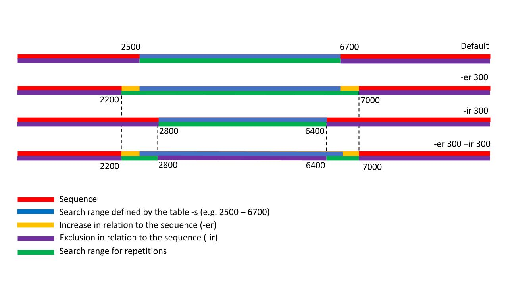
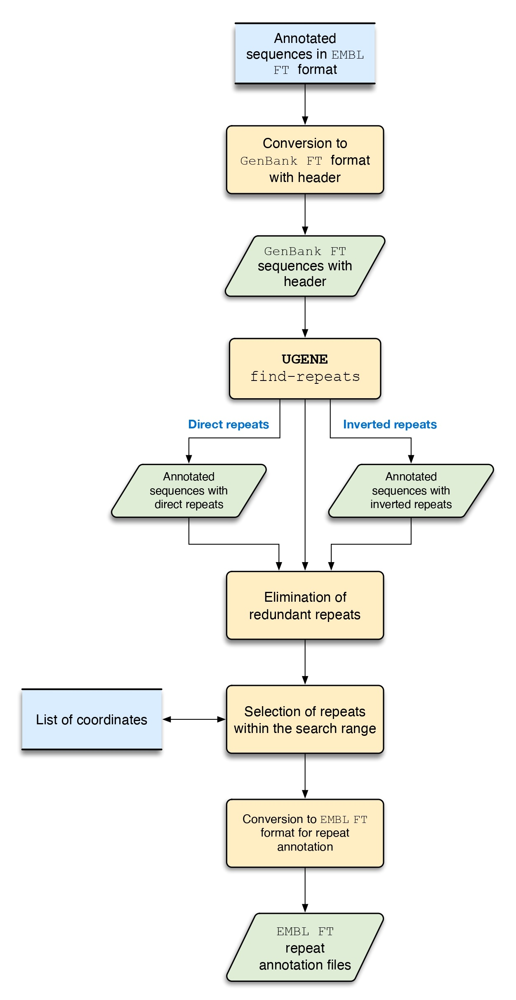

# Select_repeats: A Tool for Filtering and Selecting Genomic Repeat Regions

## Overview

`select_repeats` is a command-line bioinformatics pipeline script designed to automate the identification, filtering, and selection of genomic repeat regions. It is particularly useful for studying mobile genetic elements like casposons or transposons, which are often characterized by terminal inverted repeats (TIRs) or flanked by target site duplications (TSDs).

The script streamlines a complex workflow by:
1.  Converting feature tables from EMBL format (used by Artemis) to a GenBank format compatible with the UGENE toolkit.
2.  Orchestrating multiple UGENE `find-repeats` runs with different parameters to sensitively detect repeats.
3.  Filtering the resulting direct or inverted repeats based on user-defined coordinate rules, allowing researchers to isolate repeats within specific genomic loci.
4.  Generating clean, annotation-ready feature tables for downstream analysis and visualization.

## Features

* **Batch Processing:** Processes single EMBL feature table files or entire folders containing multiple files.
* **Format Conversion:** Automatically converts EMBL feature tables to a UGENE-compatible GenBank format.
* **UGENE Integration:** Seamlessly integrates with the UGENE command-line tool to find direct (`TDR`) and inverted (`TIR`) repeats using multiple, user-configurable parameter sets.
* **Coordinate-Based Filtering:** Filters identified repeats based on specific coordinate ranges provided in a simple CSV decision table, focusing the analysis on relevant genomic regions.
* **Flexible Filtering Rules:** Allows for fine-tuned adjustments to the filtering coordinates using internal (`-ir`) and external (`-er`) range parameters for precise control over the search space.
* **Clean Outputs:** Generates separate, well-formatted GenBank feature tables for the selected direct and inverted repeats, ready for import into visualization tools like Artemis. The output includes color-coding for easy distinction between repeat types.
* **Detailed Logging:** Maintains a comprehensive `file.log` for each run, documenting the parameters, execution times, and processing status of each input file for enhanced reproducibility.

## Prerequisites

### Python

* **Python 3.x** is required to run this script.

### Python Libraries

* The script uses only standard Python libraries (`os`, `sys`, `re`, `argparse`). No external packages need to be installed via `pip`.

### External Software

* **UGENE:** The UGENE command-line tool (`ugene` or `ugenecl`) **must be installed** and its executable must be accessible in your system's `PATH`. You can verify this by opening a terminal and typing `ugene --version`. If it returns the version number, you are set.

## Installation

This is a standalone Python script. No installation is required. Simply download `select_repeats.py` and ensure the prerequisites listed above are met. You may want to make the script executable for convenience:

```bash
chmod +x select_repeats.py
```

## Usage

The script can be run in two ways: by providing all arguments directly on the command line, or by using a configuration file (`-conf`), which is the recommended method for complex analyses.

### Command-Line Arguments

| **Argument** | **Description** |
| :------------------ | :------------------------------------------------------------------------------------------------------------------------------- |
| `-conf <file>`      | **(Recommended)** Path to a text file containing all execution parameters.                                                       |
| `-in <file\|folder>` | Path to the input EMBL feature table file or a folder containing multiple EMBL files.                                            |
| `-o <string>`       | Name of the output file or directory.                                                                                            |
| `-div <string>`     | The three-letter GenBank division code (e.g., `CON`, `BCT`, `VRL`).                                                                |
| `-defi <string>`    | A short description for the sequence definition line (e.g., "Casposon").                                                           |
| `-s <file.csv>`     | Path to a CSV file containing the coordinate data for filtering repeats.                                                           |
| `-ir <integer>`     | **Internal Range.** An integer value to narrow the search area *inward* from the coordinates defined in the `-s` file.             |
| `-er <integer>`     | **External Range.** An integer value to expand the search area *outward* from the coordinates defined in the `-s` file.            |
| `-h`, `--help`      | Display the help message and exit.                                                                                               |
| `-version`          | Display the script version and exit.                                                                                             |

## Filtering Logic Explained

The core strength of `select_repeats` is its coordinate-based filtering. Given a region of interest from the `-s` file (e.g., from base `10000` to `20000`), the `-ir` and `-er` parameters modify the search space for valid repeat pairs.

Let's assume the CSV file specifies a region from `START` to `END`. A repeat pair is defined by `(coord1_start..coord1_end, coord2_start..coord2_end)`. The filtering logic applies to `coord1_start` and `coord2_end`.



* **Default Behavior (No `-ir` or `-er`):**
    The script only accepts repeat pairs that are fully contained *within* the specified region.
    `coord1_start >= START` and `coord2_end <= END`.
    `[... START --- (repeat_pair) --- END ...] `

* **External Range (`-er`):**
    Expands the search space outwards. This is useful for finding repeats that flank the region of interest.
    `coord1_start >= (START - er)` and `coord2_end <= (END + er)`.
    `[... (START - er) --- START --- END --- (END + er) ...] `

* **Internal Range (`-ir`):**
    Narrows the search space inwards, creating an "exclusion zone" in the middle of the region. This is useful for focusing on repeats near the boundaries.
    `coord1_start <= (START + ir)` and `coord2_end >= (END - ir)`.
    `[... START -- (valid zone) -- (START + ir) ... (END - ir) -- (valid zone) -- END ...]`

* **Combined (`-ir` and `-er`):**
    Creates two precise search windows at the boundaries of the region. A repeat's first element must fall in the first window, and its second element in the second window.
    * Window 1: `(START - er)` to `(START + ir)`
    * Window 2: `(END - ir)` to `(END + er)`
    This is the most powerful mode for finding flanking TIRs of a specific element.

## Workflow



### Step 1: Prepare Input Files

**A. EMBL Feature Table (`.tab` file)**
*Example: `FNLN01000049_1_all_results.tab`*
```
FT   gene            67..336
FT                   /locus_tag="ORF_01"
SQ   Sequence 14070 BP; 4440 A; 2619 C; 2602 G; 4407 T; 2 other
     gatgacaacg acggcaatga tgtgtcaaat agcggtgata cgggcagcaa tgacgcgggt        60
     ...
//
```

**B. CSV Decision Table (`-s` file)**
The format is `sequence_id;start_coordinate;end_coordinate`.
*Example: `coordinates.csv`*
```
FNLN01000049_1;2565;11549
AXDB01000087_1;243;13117
CP011344_1;10000;16200
```

### Step 2: Create a Configuration File

*Example: `config.cnf`*
```
# Input and Output Directories
input_dir = /home/user/data/embl_files/
out_dir = results_casposon_run1
s = /home/user/data/coordinates.csv

# GenBank Header Information
def = Casposon
div = CON

# Filtering Parameters to search 1000bp outside and 100bp inside the defined region
er = 1000
ir = 100

# --- UGENE Parameter Sets ---
# Find inverted repeats (TIRs) with 85% identity and min length of 12bp
parameter_set_1 = --task=find-repeats --identity=85 --inverted=True --out=*_inverted_repeats_12_85.gbk --exclude-repeats=True --max-distance=12000 --min-distance=5000 --min-length=12 --name=TIR
# Find perfect inverted repeats (100% identity)
parameter_set_2 = --task=find-repeats --identity=100 --inverted=True --out=*_inverted_repeats_12_100.gbk --exclude-repeats=True --max-distance=12000 --min-distance=5000 --min-length=12 --name=TIR
# Find direct repeats (TDRs) with 85% identity
parameter_set_3 = --task=find-repeats --identity=85 --inverted=False --out=*_direct_repeats_12_85.gbk --exclude-repeats=True --max-distance=12000 --min-distance=5000 --min-length=12 --name=TDR
```

### Step 3: Run the Script

```bash
./select_repeats.py -conf config.cnf
```

### Step 4: Understand the Output

The script creates the `results_casposon_run1` directory with several files for each input sequence:

* **`file.log`**: A detailed log of the entire run.
* **`*_UGENE.gbk`**: The intermediate GenBank file processed by UGENE.
* **`*_inverted_repeats_selected.gbk`**: The final feature table with selected inverted repeats.
* **`*_direct_repeats_selected.gbk`**: The final feature table with selected direct repeats.

*Example content of `*_inverted_repeats_selected.gbk`*:
```
     repeat_region   join(2540..2559,11570..11589)
                       /rpt_type=inverted
                       /rpt_unit_range=20
                       /note="repeat distance is 9011 bp"
                       /note="repeat identity is 95%"
                       /standard_name="TIR"
                       /color=255 204 204
```
This format is ready to be loaded directly as an annotation track in Artemis.

## Troubleshooting

* **Command not found: ugene**: This error means the UGENE executable is not in your system's `PATH`. Ensure your UGENE installation directory is added to your `PATH` environment variable.
* **AttributeError: 'NoneType' object has no attribute 'start'**: This typically means an input file in your `-in` directory does not follow the expected naming convention (e.g., `SEQID_1_all_results.tab`), and the script cannot extract a sequence ID. Check for extra files in the input directory.
* **No `_selected.gbk` files are generated**: This can happen if no repeats found by UGENE pass your filtering criteria. Try relaxing the `-ir`/`-er` parameters or the UGENE `identity` and `min-length` settings. Check `file.log` for messages about repeats being filtered out.

## Authors & Citation

* (c) 2022. Arthur Gruber & Giuliana Pola
* For more information, please visit the GitHub repository: <https://github.com/GiulianaPola/select_repeats>
